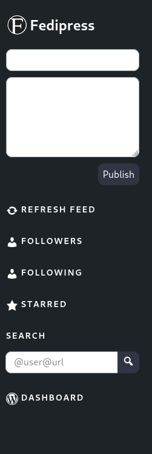

# FediPress

Wordpress Plugin to customize [Friends Plugin](https://github.com/akirk/friends) feed.

- Tested in WordPress up to: 6.7
- License: GPL-3

FediPress sets some sidebar widgets fixed and publishes made in form are public by default.




## Instalation

**You must have the Friends plugin installed

1. Upload the fedipress directory to the ```wp-content/plugins/``` directory

2. Activate the plugin through the 'Plugins' menu in WordPress

3. Go to ***Friends > Settings*** and choose the FediPress in **the Main Theme** selection area


## Sponsorship 
The FediPress theme was developed by the Pontão de Cultura Digital e Mídia Livre project of the Network of [Collaborative Cultural Producers](https://colaborativas.net/), approved in public selection notice nº 09 - MinC/SCDC - TCC – cultural commitment term - nº 951140/2023, under the coordination of [Thiago Skárnio](https://skarnio.tv/), from [Associação Alquimídia](http://alquimidia.org/), programmed by [@liviacarolgouvea](https://github.com/liviacarolgouvea/) and designed by Rafael Gonzaga from Agência Ganesha.**
